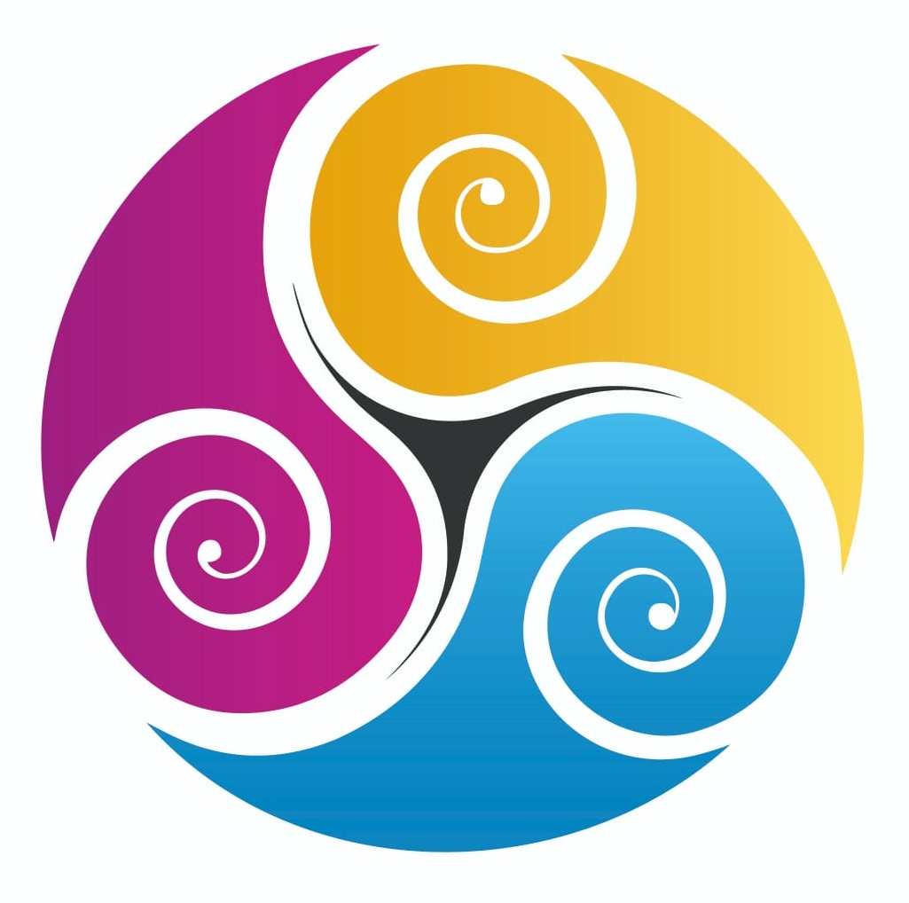

# DESIGN SYSTEM — TRISKEL ACADEMY

> **Documento único de migración.** Esta es la fuente de verdad completa y portable del design system de Triskel Academy. Contiene tokens (JSON + CSS), inventario exhaustivo de componentes con código, guías de uso, y un prompt de reconstrucción listo para pegar. No depende de ningún otro archivo.

**Producto:** App de gestión para un estudio de Pilates (Reformer, Mat, Funcional). Dos superficies: **panel de profesora** (escritorio, sidebar) y **panel de alumna** (móvil, bottom-nav). Todo el copy es **español rioplatense (voseo)**.

**Versión:** migración 2026-06 · **Idioma de UI:** es-AR · **Origen:** reconstruido desde `elterco2012-dev/triskel-academy` (`/panel/index.html`, `/panel/alumna.html`).

---

## ÍNDICE

1. [Tokens de diseño](#1-tokens-de-diseño)
   - 1.1 [JSON](#11-tokens-en-json)
   - 1.2 [CSS Variables](#12-tokens-en-css-variables)
2. [Inventario de componentes](#2-inventario-de-componentes)
3. [Guías de uso](#3-guías-de-uso)
4. [Instrucciones de reconstrucción](#4-instrucciones-de-reconstrucción)

---

# 1. TOKENS DE DISEÑO

## 1.1 Tokens en JSON

```json
{
  "color": {
    "brand": {
      "violet":        { "value": "#7C5CBF", "desc": "Acción primaria, nav activo, links" },
      "violet-deep":   { "value": "#5B3F9E", "desc": "Hover/pressed del primario" },
      "violet-medium": { "value": "#A07ED4", "desc": "Acentos, labels sobre oscuro" },
      "violet-tint":   { "value": "#EDE9F8", "desc": "Fondo nav activo, superficies suaves" },
      "magenta":       { "value": "#C32E8B", "desc": "Swirl del logo. Solo mark/hero" },
      "yellow":        { "value": "#E8A82C", "desc": "Swirl del logo. Solo mark/hero" },
      "cyan":          { "value": "#1E92C8", "desc": "Swirl del logo. Solo mark/hero" }
    },
    "modality": {
      "mat":            { "value": "#1D9E75", "tint": "#E1F5EE", "desc": "Mat Pilates — verde" },
      "reformer":       { "value": "#2563EB", "tint": "#EFF6FF", "desc": "Reformer — azul" },
      "funcional":      { "value": "#D97706", "tint": "#FFFBEB", "desc": "Funcional — ámbar" }
    },
    "status": {
      "success":        { "value": "#1D9E75", "tint": "#E1F5EE" },
      "warning":        { "value": "#D97706", "tint": "#FFFBEB" },
      "danger":         { "value": "#A32D2D", "tint": "#FCEBEB" },
      "info":           { "value": "#2563EB", "tint": "#EFF6FF" }
    },
    "surface": {
      "bg":             { "value": "#F8F8F6", "desc": "Fondo de página (off-white cálido)" },
      "bg-elevated":    { "value": "#FFFFFF", "desc": "Tarjetas, sheets" },
      "bg-muted":       { "value": "#F3F4F2", "desc": "Inputs, superficies secundarias" },
      "bg-sunken":      { "value": "#EBEBEA", "desc": "Divisores, fondos hundidos" }
    },
    "text": {
      "fg":             { "value": "#1A1A1A", "desc": "Texto primario" },
      "fg-muted":       { "value": "#6B7280", "desc": "Texto secundario, labels" },
      "fg-faint":       { "value": "#9CA3AF", "desc": "Texto terciario, hints" },
      "fg-on-violet":   { "value": "#FFFFFF" }
    },
    "border": {
      "border":         { "value": "rgba(0,0,0,0.07)", "desc": "Bordes de tarjeta" },
      "border-strong":  { "value": "rgba(0,0,0,0.13)", "desc": "Bordes de input" }
    }
  },
  "typography": {
    "family": {
      "display": "'DM Serif Display', 'Times New Roman', serif",
      "sans":    "'DM Sans', -apple-system, BlinkMacSystemFont, 'Segoe UI', sans-serif",
      "mono":    "ui-monospace, 'SF Mono', Menlo, monospace"
    },
    "weight": { "regular": 400, "medium": 500, "semibold": 600, "bold": 700 },
    "scale": {
      "display": { "weight": 600, "size": "2.4rem", "lineHeight": 1.1, "family": "display", "use": "hero de página" },
      "h1":      { "weight": 400, "size": "1.6rem", "lineHeight": 1.2, "family": "display", "use": ".ptitle, título de página" },
      "h2":      { "weight": 400, "size": "1.2rem", "lineHeight": 1.3, "family": "display", "use": "título de modal" },
      "h3":      { "weight": 600, "size": "0.9rem", "lineHeight": 1.3, "family": "sans",    "use": "logo sidebar" },
      "body":    { "weight": 400, "size": "13px",   "lineHeight": 1.5, "family": "sans",    "use": "texto app (profesora)" },
      "body-lg": { "weight": 400, "size": "15px",   "lineHeight": 1.5, "family": "sans",    "use": "texto app (alumna)" },
      "label":   { "weight": 600, "size": "11px",   "lineHeight": 1.2, "family": "sans",    "use": ".ctitle uppercase" },
      "caption": { "weight": 400, "size": "11px",   "lineHeight": 1.4, "family": "sans",    "use": "labels secundarios" },
      "button":  { "weight": 500, "size": "13px",   "lineHeight": 1.2, "family": "sans",    "use": "texto de botón" },
      "metric":  { "weight": 700, "size": "1.5rem", "lineHeight": 1,   "family": "sans",    "use": "números grandes" }
    }
  },
  "spacing": {
    "space-1": "4px",  "space-2": "8px",  "space-3": "12px", "space-4": "16px",
    "space-5": "20px", "space-6": "24px", "space-7": "32px", "space-8": "40px"
  },
  "radius": {
    "sm":          "6px",
    "default":     "9px",
    "lg":          "14px",
    "pill":        "9999px",
    "bottomsheet": "20px 20px 0 0"
  },
  "shadow": {
    "sm":    "0 1px 2px rgba(108,91,123,0.06)",
    "base":  "0 2px 12px rgba(108,91,123,0.10)",
    "lg":    "0 8px 28px rgba(108,91,123,0.15)",
    "modal": "0 24px 48px rgba(0,0,0,0.25)"
  },
  "breakpoint": {
    "mobile-max":   "480px",
    "sidebar-hide": "680px",
    "sidebar-width":"180px",
    "bottomnav-height": "56px",
    "modal-max-width":  "540px"
  },
  "motion": {
    "ease-out":      "cubic-bezier(0.16, 1, 0.3, 1)",
    "duration-fast": "120ms",
    "duration":      "200ms",
    "duration-slow": "300ms"
  }
}
```

### Tokens de tema oscuro (overrides)

```json
{
  "dark": {
    "bg": "#111110", "bg-elevated": "#1C1C1A", "bg-muted": "#242422", "bg-sunken": "#2E2E2B",
    "fg": "#F0EDE8", "fg-muted": "#9CA3AF", "fg-faint": "#6B7280",
    "border": "rgba(255,255,255,0.07)", "border-strong": "rgba(255,255,255,0.12)",
    "brand-violet-tint": "#1E1535", "brand-violet-medium": "#9B7ED4",
    "mod-mat-tint": "#0A2E20", "mod-reformer-tint": "#0F1E3A", "mod-funcional-tint": "#2A1A05",
    "status-danger": "#F09595", "status-danger-tint": "#2A1010",
    "shadow": "0 2px 12px rgba(0,0,0,0.4)"
  }
}
```

## 1.2 Tokens en CSS variables

> Archivo fuente: `colors_and_type.css`. Pegar tal cual. Incluye el `@import` de fuentes, las variables, el tema oscuro y las clases helper de tipografía.

```css
/* ── Fuentes ── */
@import url('https://fonts.googleapis.com/css2?family=DM+Sans:wght@400;500;600;700&family=DM+Serif+Display:ital@0;1&display=swap');

:root {
  /* ── Brand ── */
  --brand-violet:        #7C5CBF;  /* primary action */
  --brand-violet-deep:   #5B3F9E;  /* pressed / hover-dark */
  --brand-violet-medium: #A07ED4;  /* labels on dark, accents */
  --brand-violet-tint:   #EDE9F8;  /* selected nav, surfaces */
  --brand-magenta:       #C32E8B;  /* logo swirl — mark/hero only */
  --brand-yellow:        #E8A82C;  /* logo swirl — mark/hero only */
  --brand-cyan:          #1E92C8;  /* logo swirl — mark/hero only */

  /* ── Modalidades (disciplinas de Pilates) ── */
  --mod-mat:             #1D9E75;  --mod-mat-tint:        #E1F5EE;
  --mod-reformer:        #2563EB;  --mod-reformer-tint:   #EFF6FF;
  --mod-funcional:       #D97706;  --mod-funcional-tint:  #FFFBEB;

  /* ── Status / semántico ── */
  --status-success:      #1D9E75;  --status-success-tint: #E1F5EE;
  --status-warning:      #D97706;  --status-warning-tint: #FFFBEB;
  --status-danger:       #A32D2D;  --status-danger-tint:  #FCEBEB;
  --status-info:         #2563EB;  --status-info-tint:    #EFF6FF;

  /* ── Superficies & neutros (claro) ── */
  --bg:                  #F8F8F6;  --bg-elevated:         #FFFFFF;
  --bg-muted:            #F3F4F2;  --bg-sunken:           #EBEBEA;

  /* ── Texto (claro) ── */
  --fg:                  #1A1A1A;  --fg-muted:            #6B7280;
  --fg-faint:            #9CA3AF;  --fg-on-violet:        #FFFFFF;

  /* ── Bordes (claro) ── */
  --border:              rgba(0,0,0,0.07);
  --border-strong:       rgba(0,0,0,0.13);

  /* ── Radios ── */
  --radius-sm:           6px;
  --radius:              9px;
  --radius-lg:           14px;
  --radius-pill:         9999px;
  --radius-bottomsheet:  20px 20px 0 0;

  /* ── Sombras ── */
  --shadow-sm:           0 1px 2px rgba(108, 91, 123, 0.06);
  --shadow:              0 2px 12px rgba(108, 91, 123, 0.10);
  --shadow-lg:           0 8px 28px rgba(108, 91, 123, 0.15);
  --shadow-modal:        0 24px 48px rgba(0, 0, 0, 0.25);

  /* ── Espaciado ── */
  --space-1: 4px;  --space-2: 8px;  --space-3: 12px; --space-4: 16px;
  --space-5: 20px; --space-6: 24px; --space-7: 32px; --space-8: 40px;

  /* ── Familias tipográficas ── */
  --font-display: 'DM Serif Display', 'Times New Roman', serif;
  --font-sans:    'DM Sans', -apple-system, BlinkMacSystemFont, 'Segoe UI', sans-serif;
  --font-mono:    ui-monospace, 'SF Mono', Menlo, monospace;

  /* ── Escala tipográfica semántica ── */
  --type-display:  600 2.4rem/1.1 var(--font-display);
  --type-h1:       400 1.6rem/1.2 var(--font-display);
  --type-h2:       400 1.2rem/1.3 var(--font-display);
  --type-h3:       600 0.9rem/1.3 var(--font-sans);
  --type-body:     400 13px/1.5  var(--font-sans);
  --type-body-lg:  400 15px/1.5  var(--font-sans);
  --type-label:    600 11px/1.2  var(--font-sans);
  --type-caption:  400 11px/1.4  var(--font-sans);
  --type-button:   500 13px/1.2  var(--font-sans);
  --type-metric:   700 1.5rem/1  var(--font-sans);

  /* ── Constantes de layout ── */
  --sidebar-width:    180px;
  --bottomnav-height: 56px;
  --mobile-max-width: 480px;
  --modal-max-width:  540px;

  /* ── Movimiento ── */
  --ease-out:      cubic-bezier(0.16, 1, 0.3, 1);
  --duration-fast: 120ms;
  --duration:      200ms;
  --duration-slow: 300ms;
}

/* ── Tema oscuro ── */
[data-theme="dark"] {
  --bg:                  #111110;
  --bg-elevated:         #1C1C1A;
  --bg-muted:            #242422;
  --bg-sunken:           #2E2E2B;
  --fg:                  #F0EDE8;
  --fg-muted:            #9CA3AF;
  --fg-faint:            #6B7280;
  --border:              rgba(255,255,255,0.07);
  --border-strong:       rgba(255,255,255,0.12);
  --brand-violet-tint:   #1E1535;
  --brand-violet-medium: #9B7ED4;
  --mod-mat-tint:        #0A2E20;
  --mod-reformer-tint:   #0F1E3A;
  --mod-funcional-tint:  #2A1A05;
  --status-danger:       #F09595;
  --status-danger-tint:  #2A1010;
  --shadow:              0 2px 12px rgba(0,0,0,0.4);
}

/* ── Estilos base ── */
html, body {
  font: var(--type-body);
  color: var(--fg);
  background: var(--bg);
  -webkit-font-smoothing: antialiased;
  text-rendering: optimizeLegibility;
}
h1 { font: var(--type-h1); margin: 0; }
h2 { font: var(--type-h2); margin: 0; }
h3 { font: var(--type-h3); margin: 0; }
p  { font: var(--type-body); margin: 0; }

/* ── Helpers de tipografía ── */
.ds-display { font: var(--type-display); }
.ds-h1      { font: var(--type-h1); }
.ds-h2      { font: var(--type-h2); }
.ds-h3      { font: var(--type-h3); }
.ds-body    { font: var(--type-body); }
.ds-body-lg { font: var(--type-body-lg); }
.ds-label   { font: var(--type-label); text-transform: uppercase; letter-spacing: 0.06em; color: var(--fg-muted); }
.ds-caption { font: var(--type-caption); color: var(--fg-muted); }
.ds-metric  { font: var(--type-metric); color: var(--fg); }
```

---

# 2. INVENTARIO DE COMPONENTES

El sistema tiene **dos familias de componentes** que comparten tokens pero difieren en patrón:

| Familia | Prefijo CSS | Prefijo React | Superficie | Tarjeta característica |
|---|---|---|---|---|
| **Teacher Panel** | `.tp-*` | `TP*` | Escritorio, sidebar fija 180px | Plana (borde 1px, sin sombra) |
| **Student Panel** | `.sp-*` | `SP*` | Móvil, máx 480px, bottom-nav | Flotante (sombra violeta, sin borde) |

> **Regla de scope:** los estilos `.tp-*` deben envolverse en un contenedor `.tp-root`; los `.sp-*` en `.sp-app`. Ambos `@import` `colors_and_type.css`.

Cada componente abajo incluye: descripción, código completo (CSS + uso React si aplica), variantes y estados.

---

## 2.A — FOUNDATIONS

### 2.A.1 Tipografía (specimens)

| Nivel | Token | Render |
|---|---|---|
| Display | `--type-display` | DM Serif Display 2.4rem — hero / empty-state |
| H1 / `.tp-ptitle` | `--type-h1` | DM Serif Display 1.6rem — título de página |
| H2 / título modal | `--type-h2` | DM Serif Display 1.2rem |
| H3 / logo sidebar | `--type-h3` | DM Sans 600 0.9rem |
| Body (profesora) | `--type-body` | DM Sans 400 13px |
| Body (alumna) | `--type-body-lg` | DM Sans 400 15px |
| Label / `.ctitle` | `--type-label` | DM Sans 600 11px UPPERCASE, tracking .06em |
| Caption | `--type-caption` | DM Sans 400 11px muted |
| Button | `--type-button` | DM Sans 500 13px |
| Metric | `--type-metric` | DM Sans 700 1.5rem |

```html
<div class="ds-display">Triskel Academy</div>
<div class="ds-h1">Inicio</div>
<div class="ds-label">SECCIÓN</div>
<div class="ds-metric">$612.500</div>
```

### 2.A.2 Avatar (iniciales)

Círculo violeta con iniciales. Tamaños: 30, 36, 48, 64, 90px.

```css
.tp-avatar {
  width: 36px; height: 36px; border-radius: 50%;
  background: var(--brand-violet-tint);
  color: var(--brand-violet-deep);
  display: flex; align-items: center; justify-content: center;
  font: 600 13px var(--font-sans); flex-shrink: 0;
}
/* variantes de tamaño: aplicar width/height + font-size inline o utilitario */
```

**Regla crítica:** el avatar es **siempre violeta** (`--brand-violet-tint` / `--brand-violet-deep`). Nunca usar granate/rojo para avatares — el rojo está reservado a estados negativos. Helper de iniciales:

```js
const inits = (nombre, apellido) =>
  ((nombre||"?")[0] + ((apellido||"")[0]||"")).toUpperCase();
```

---

## 2.B — TEACHER PANEL (`.tp-*`)

### 2.B.1 Botón — `.tp-btn`

Variantes: default (secundario), `.tp-btn-primary`, `.tp-btn-danger`. Modificador de tamaño: `.tp-btn-small`.

```css
.tp-btn {
  padding: 6px 14px;
  border: 1px solid var(--border-strong);
  border-radius: var(--radius);
  background: var(--bg-elevated);
  color: var(--fg);
  font: var(--type-button);
  transition: background var(--duration-fast);
  cursor: pointer;
}
.tp-btn:hover { background: var(--bg-muted); }                 /* estado hover */
.tp-btn-primary { background: var(--brand-violet); border-color: var(--brand-violet); color: #fff; }
.tp-btn-primary:hover { background: var(--brand-violet-deep); border-color: var(--brand-violet-deep); }
.tp-btn-small { padding: 4px 10px; font-size: 11px; }
.tp-btn-danger { background: var(--status-danger-tint); border-color: var(--status-danger); color: var(--status-danger); }
```

| Variante | Uso | Estados |
|---|---|---|
| `.tp-btn` | Acción secundaria (Cancelar, Editar) | hover → `--bg-muted` |
| `.tp-btn-primary` | Acción principal (Guardar, + Nueva) | hover → `--brand-violet-deep` |
| `.tp-btn-danger` | Destructivo (Baja) | — |
| `+ .tp-btn-small` | Acciones inline en filas | — |

```jsx
<button className="tp-btn tp-btn-primary">+ Nueva alumna</button>
<button className="tp-btn tp-btn-small">Editar</button>
<button className="tp-btn tp-btn-danger">Baja</button>
```

### 2.B.2 Input / Select / Textarea

```css
.tp-root input, .tp-root select, .tp-root textarea {
  width: 100%; padding: 8px 12px;
  border: 1px solid var(--border-strong);
  border-radius: var(--radius);
  font: var(--type-body); font-family: var(--font-sans);
  background: var(--bg-muted); color: var(--fg);
  margin-bottom: 10px;
  transition: border-color var(--duration-fast);
  outline: none;
}
.tp-root input:focus,
.tp-root select:focus,
.tp-root textarea:focus { border-color: var(--brand-violet); }  /* estado focus */
.tp-root textarea { resize: vertical; height: 60px; }
```

**Estados:** default (fondo `--bg-muted`), focus (borde violeta). Para **error**, usar `border-color: var(--status-danger)` y un `<label style="color:var(--status-danger)">` (patrón usado en el campo de contraindicaciones).

### 2.B.3 Tarjeta — `.tp-card`

Tarjeta **plana**: borde 1px, sin sombra. Modificadores de acento por borde izquierdo.

```css
.tp-card {
  background: var(--bg-elevated);
  border: 1px solid var(--border);
  border-radius: var(--radius-lg);
  padding: 1.25rem;
  margin-bottom: 1rem;
}
.tp-card-accent-violet    { border-left: 3px solid var(--brand-violet); }
.tp-card-accent-funcional { border-color: var(--mod-funcional); }
.tp-ctitle {
  font: 600 11px var(--font-sans);
  color: var(--fg-muted);
  text-transform: uppercase;
  letter-spacing: 0.06em;
  margin-bottom: 0.75rem;
}
```

```jsx
const TPCard = ({ children, title, accent, style }) => {
  const cls = "tp-card" + (accent ? ` tp-card-accent-${accent}` : "");
  return (
    <div className={cls} style={style}>
      {title ? <div className="tp-ctitle">{title}</div> : null}
      {children}
    </div>
  );
};
```

**Variantes:** sin acento (default), `accent="violet"` (resumen/semana), `accent="funcional"` (atención/recordatorios). El título usa el micro-label uppercase `.tp-ctitle`.

### 2.B.4 Métrica — `.tp-metric`

Número grande + label. Tonos de color por significado.

```css
.tp-metric {
  background: var(--bg-elevated);
  border: 1px solid var(--border);
  border-radius: var(--radius);
  padding: 0.75rem 1rem;
}
.tp-metric-label { font: var(--type-caption); margin-bottom: 0.2rem; color: var(--fg-muted); }
.tp-metric-value { font: 700 1.5rem/1 var(--font-sans); color: var(--fg); }
.tp-metric-value.violet  { color: var(--brand-violet); }
.tp-metric-value.warning { color: var(--status-warning); }
.tp-metric-value.success { color: var(--status-success); }
```

```jsx
const TPMetric = ({ label, value, tone }) => (
  <div className="tp-metric">
    <div className="tp-metric-label">{label}</div>
    <div className={"tp-metric-value" + (tone ? " " + tone : "")}>{value}</div>
  </div>
);
// Uso en grilla de 4:
// <div style={{display:"grid",gridTemplateColumns:"repeat(4,1fr)",gap:10}}>...</div>
```

**Tonos:** default (neutro), `violet` (KPI de marca), `warning` (pendientes), `success` (recaudado).

### 2.B.5 Badge de modalidad — `.tp-badge`

Pill con tint + color de modalidad.

```css
.tp-badge {
  display: inline-flex; align-items: center; gap: 4px;
  padding: 2px 8px; border-radius: 99px;
  font: 500 11px var(--font-sans);
}
.tp-badge-mat       { background: var(--mod-mat-tint);       color: var(--mod-mat); }
.tp-badge-reformer  { background: var(--mod-reformer-tint);  color: var(--mod-reformer); }
.tp-badge-funcional { background: var(--mod-funcional-tint); color: var(--mod-funcional); }
```

```jsx
const TPBadge = ({ modalidad, children }) => (
  <span className={`tp-badge tp-badge-${modalidad}`}>
    {children || window.TP_MOD_LABEL[modalidad] || modalidad}
  </span>
);
// TP_MOD_LABEL = { mat:"Mat", reformer:"Reformer", funcional:"Funcional" }
```

**Variantes:** `mat` (verde), `reformer` (azul), `funcional` (ámbar).

### 2.B.6 Pill de estado de pago — `.tp-pago-pill`

```css
.tp-pago-pill {
  font: 500 10px var(--font-sans);
  padding: 1px 7px; border-radius: 99px; white-space: nowrap;
}
.tp-pago-pill.ok       { background: var(--mod-mat-tint);       color: var(--mod-mat); }      /* ✓ Pagó */
.tp-pago-pill.late     { background: #fee2e2;                   color: #dc2626; }             /* Pendiente */
.tp-pago-pill.upcoming { background: var(--mod-funcional-tint); color: var(--mod-funcional); } /* Vence día N */
```

**Estados:** `ok` (pagó), `late` (vencido/impago), `upcoming` (por vencer).

### 2.B.7 Fila de alumna — `.tp-arow`

```css
.tp-arow {
  background: var(--bg-elevated);
  border: 1px solid var(--border);
  border-radius: var(--radius);
  padding: 0.75rem 1rem;
  display: flex; align-items: center; gap: 12px;
  margin-bottom: 0.5rem;
}
.tp-arow:hover { border-color: var(--border-strong); }   /* estado hover */
.tp-aname { font: 500 14px var(--font-sans); }
.tp-aname-link { cursor: pointer; text-decoration: underline; text-underline-offset: 3px; }
.tp-asub { font: 11px var(--font-sans); color: var(--fg-muted); display: flex; gap: 6px; flex-wrap: wrap; align-items: center; margin-top: 2px; }
```

```jsx
const TPAlumnaRow = ({ alumna, inscs, pagoStatus, onEdit, onOpen }) => (
  <div className="tp-arow">
    <div className="tp-avatar">{window.TP_alumnaInits(alumna.nombre, alumna.apellido)}</div>
    <div style={{flex:1, minWidth:0}}>
      <div className="tp-aname tp-aname-link" onClick={() => onOpen(alumna.id)}>
        {alumna.nombre} {alumna.apellido || ""}
      </div>
      <div className="tp-asub">
        {inscs.map((i, idx) => i.horario ? (
          <span key={idx} style={{display:"inline-flex",alignItems:"center",gap:3}}>
            <TPBadge modalidad={i.horario.modalidad} />
            <span style={{font:"10px var(--font-sans)",color:"var(--fg-muted)"}}>
              {window.TP_DIA_LABEL[i.horario.dia]} {i.horario.hora_inicio}
            </span>
          </span>
        ) : null)}
        {alumna.tel && <a href={"https://wa.me/" + alumna.tel} target="_blank"
          style={{font:"11px var(--font-sans)",color:"var(--mod-mat)",textDecoration:"none"}}>💬 WA</a>}
      </div>
    </div>
    {inscs.length > 0 && pagoStatus && (
      <span className={"tp-pago-pill " + pagoStatus.kind}>{pagoStatus.label}</span>
    )}
    <div style={{display:"flex",gap:6,flexWrap:"wrap"}}>
      <button className="tp-btn tp-btn-small" onClick={() => onEdit(alumna.id)}>Editar</button>
      {alumna.estado === "activa"  && <button className="tp-btn tp-btn-small">⏸ Pausar</button>}
      {alumna.estado === "pausada" && <button className="tp-btn tp-btn-small tp-btn-primary">▶ Reactivar</button>}
    </div>
  </div>
);
```

**Estados de la entidad:** `activa` (muestra ⏸ Pausar), `pausada` (muestra ▶ Reactivar), `baja`.

### 2.B.8 Grilla de horarios — `.tp-hgrid` + slot `.tp-hslot`

Grilla de 5 columnas (lun–vie). Cada slot coloreado por modalidad con indicador de capacidad.

```css
.tp-hgrid { display: grid; grid-template-columns: repeat(5, 1fr); gap: 6px; }
.tp-hday {
  font: 600 11px var(--font-sans); color: var(--fg-muted);
  text-transform: uppercase; text-align: center;
  padding: 0.4rem 0; border-bottom: 2px solid var(--border); margin-bottom: 4px;
}
.tp-hcol { display: flex; flex-direction: column; gap: 6px; }
.tp-hslot {
  border-radius: 8px; padding: 8px 6px; text-align: center; cursor: pointer;
  border: 1.5px solid transparent;
  transition: transform 100ms, box-shadow 100ms;
}
.tp-hslot:hover { transform: translateY(-1px); box-shadow: 0 3px 10px rgba(0,0,0,0.1); } /* hover: lift */
.tp-hslot.mat       { background: var(--mod-mat-tint);       border-color: var(--mod-mat); }
.tp-hslot.reformer  { background: var(--mod-reformer-tint);  border-color: var(--mod-reformer); }
.tp-hslot.funcional { background: var(--mod-funcional-tint); border-color: var(--mod-funcional); }
.tp-hslot-time { font: 600 10px var(--font-sans); color: var(--fg-muted); }
.tp-hslot-mod  { font: 600 11px var(--font-sans); margin-top: 2px; }
.tp-hslot-mod.mat { color: var(--mod-mat); } .tp-hslot-mod.reformer { color: var(--mod-reformer); } .tp-hslot-mod.funcional { color: var(--mod-funcional); }
.tp-hslot-n    { font: 10px var(--font-sans); color: var(--fg-muted); margin-top: 2px; }
```

**Indicador de capacidad** (color del texto `.tp-hslot-n`): verde `<80%`, ámbar `≥80%`, rojo `COMPLETO` (`≥100%`).

```js
const capColor = (n, cap) => { const p = n/cap;
  return p >= 1 ? "var(--status-danger)" : p >= 0.8 ? "var(--mod-funcional)" : "var(--mod-mat)"; };
const capText = (n, cap) => { const left = cap-n;
  return left <= 0 ? `${n}/${cap} · COMPLETO` : `${n}/${cap} · ${left} libre${left!==1?'s':''}`; };
```

### 2.B.9 Fila de recordatorio — `.tp-rem-row` + `.tp-wa-btn`

```css
.tp-rem-row {
  display: flex; align-items: center; gap: 10px;
  padding: 7px 0; border-bottom: 1px solid var(--border);
}
.tp-rem-row:last-child { border-bottom: none; }
.tp-wa-btn {
  padding: 4px 10px; border: 1px solid var(--mod-mat);
  border-radius: var(--radius); background: var(--mod-mat-tint);
  color: var(--mod-mat); font: 500 11px var(--font-sans);
  text-decoration: none; white-space: nowrap;
}
```

### 2.B.10 Sidebar — `.tp-sidebar`

Navegación fija 180px con logo, buscador, nav agrupado, footer (modo oscuro + salir).

```css
.tp-shell { display: flex; min-height: 100%; background: var(--bg); height: 100%; overflow: hidden; }
.tp-sidebar { width: 180px; background: var(--bg-elevated); border-right: 1px solid var(--border); padding: 1.25rem 0; display: flex; flex-direction: column; flex-shrink: 0; }
.tp-sidebar-logo { padding: 0 1.25rem 1.25rem; border-bottom: 1px solid var(--border); margin-bottom: 0.75rem; }
.tp-sidebar-logo-name { font: var(--type-h3); display: flex; align-items: center; gap: 8px; }
.tp-sidebar-logo-name img { width: 28px; height: 28px; border-radius: 50%; object-fit: cover; flex-shrink: 0; background: #fff; }
.tp-sidebar-logo-sub { font: var(--type-caption); margin-top: 2px; }
.tp-sidebar-search { padding: 12px 16px; border-bottom: 1px solid var(--border); }
.tp-sidebar-search input { margin: 0; font: 13px var(--font-sans); padding: 7px 10px; }
.tp-snav { display: flex; flex-direction: column; gap: 2px; padding: 0 0.5rem; flex: 1; }
.tp-snav a { display: flex; align-items: center; gap: 8px; padding: 8px 10px; border-radius: var(--radius); font: 13px var(--font-sans); color: var(--fg-muted); text-decoration: none; cursor: pointer; transition: background var(--duration-fast), color var(--duration-fast); }
.tp-snav a:hover { background: var(--bg-muted); color: var(--fg); }                 /* hover */
.tp-snav a.active { background: var(--brand-violet-tint); color: var(--brand-violet-deep); font-weight: 500; } /* activo */
.tp-snav .sep { font: 600 10px var(--font-sans); color: var(--fg-faint); text-transform: uppercase; letter-spacing: 0.05em; padding: 8px 10px 4px; }
.tp-sbottom { padding: 0.75rem 0.5rem; border-top: 1px solid var(--border); }
.tp-sbottom button { width: 100%; padding: 7px 10px; border: none; background: none; color: var(--fg-muted); font: 12px var(--font-sans); text-align: left; border-radius: var(--radius); display: flex; align-items: center; gap: 6px; }
.tp-sbottom button:hover { background: var(--bg-muted); }
.tp-main { flex: 1; padding: 2rem; min-height: 100%; overflow-y: auto; }
.tp-ptitle { font: var(--type-h1); margin-bottom: 1.5rem; }
```

```jsx
const TPSidebar = ({ current, onNav, onSearch, onOpenTarifas, onOpenMensajes, onToggleTheme, onLogout, badgePagos }) => {
  const items = [
    { sep: "Principal" },
    { id: "inicio",   ico: "🏠", lbl: "Inicio" },
    { id: "alumnas",  ico: "👤", lbl: "Alumnas" },
    { sep: "Clases" },
    { id: "horarios", ico: "📅", lbl: "Horarios" },
    { id: "clases",   ico: "📝", lbl: "Planificar" },
    { id: "historial",ico: "📚", lbl: "Historial" },
    { sep: "Gestión" },
    { id: "pagos",    ico: "💰", lbl: "Pagos", badge: badgePagos },
    { id: "tarifas",  ico: "⚙",  lbl: "Tarifas", action: onOpenTarifas },
    { id: "mensajes", ico: "💬", lbl: "Mensajes WA", action: onOpenMensajes },
  ];
  return (
    <aside className="tp-sidebar">
      <div className="tp-sidebar-logo">
        <div className="tp-sidebar-logo-name">
           Triskel Academy
        </div>
        <div className="tp-sidebar-logo-sub">Panel de gestión</div>
      </div>
      <div className="tp-sidebar-search">
        <input placeholder="🔍 Buscar alumna..." onChange={(e) => onSearch && onSearch(e.target.value)} />
      </div>
      <nav className="tp-snav">
        {items.map((it, idx) => it.sep ? (
          <div key={"sep"+idx} className="sep">{it.sep}</div>
        ) : (
          <a key={it.id} className={current === it.id ? "active" : ""} href="#"
             onClick={(e) => { e.preventDefault(); it.action ? it.action() : onNav(it.id); }}>
            <span>{it.ico}</span>
            <span style={{flex:1}}>{it.lbl}</span>
            {it.badge ? <span style={{background:"var(--status-danger)",color:"#fff",font:"700 10px var(--font-sans)",borderRadius:"99px",padding:"1px 6px"}}>{it.badge}</span> : null}
          </a>
        ))}
      </nav>
      <div className="tp-sbottom">
        <button onClick={onToggleTheme}>🌙 Modo oscuro</button>
        <button onClick={onLogout} style={{marginTop:2}}>↩ Salir</button>
      </div>
    </aside>
  );
};
```

**Estados de ítem nav:** default (muted), `:hover` (fondo muted), `.active` (fondo violet-tint, texto violet-deep, peso 500). El ítem Pagos acepta un `badge` numérico (rojo) de pendientes.

### 2.B.11 Modal — `.tp-modal`

Modal centrado, overlay scrim 40%, sombra profunda.

```css
.tp-modal-bg {
  position: absolute; inset: 0; background: rgba(0,0,0,0.4);
  z-index: 100; display: flex; align-items: center; justify-content: center;
  padding: 1rem; animation: tp-fadein 200ms;
}
@keyframes tp-fadein { from { opacity: 0; } to { opacity: 1; } }
.tp-modal {
  background: var(--bg-elevated); border-radius: var(--radius-lg);
  padding: 1.5rem; width: 100%; max-width: 540px; max-height: 88%;
  overflow-y: auto; box-shadow: var(--shadow-modal);
}
.tp-modal h3 { font: var(--type-h2); margin-bottom: 1rem; }
.tp-modal label { font: 600 12px var(--font-sans); color: var(--fg-muted); display: block; margin-bottom: 4px; }
.tp-frow { display: grid; grid-template-columns: 1fr 1fr; gap: 10px; }
```

```jsx
// Modal "Nueva alumna" — patrón completo con formulario en grilla 2-col
const TPModalAlumna = ({ onCancel, onSave }) => {
  const [form, setForm] = React.useState({ nombre:"", apellido:"", tel:"", email:"", notas:"", contra:"", dia_pago:"", nacimiento:"" });
  const set = (k) => (e) => setForm({ ...form, [k]: e.target.value });
  return (
    <div className="tp-modal-bg" onClick={(e) => e.target===e.currentTarget && onCancel()}>
      <div className="tp-modal" onClick={(e) => e.stopPropagation()}>
        <h3>Nueva alumna</h3>
        <div className="tp-frow">
          <div><label>Nombre *</label><input value={form.nombre} onChange={set("nombre")} placeholder="Ej: María" /></div>
          <div><label>Apellido</label><input value={form.apellido} onChange={set("apellido")} placeholder="Ej: González" /></div>
        </div>
        <div className="tp-frow">
          <div><label>Teléfono (WhatsApp)</label><input value={form.tel} onChange={set("tel")} placeholder="5491112345678" /></div>
          <div><label>Email</label><input value={form.email} onChange={set("email")} placeholder="maria@gmail.com" /></div>
        </div>
        <label>Notas</label>
        <textarea value={form.notas} onChange={set("notas")} placeholder="Preferencias, observaciones..." />
        <label style={{color:"var(--status-danger)", fontWeight:600}}>🏥 Contraindicaciones / Lesiones</label>
        <textarea value={form.contra} onChange={set("contra")} style={{height:52, borderColor:"var(--status-danger)"}}
          placeholder="Ej: Rodilla derecha — sin flexión profunda · Hernia lumbar L4-L5" />
        <div className="tp-frow" style={{marginTop:4}}>
          <div><label>Día de pago (1–31)</label><input type="number" min="1" max="31" value={form.dia_pago} onChange={set("dia_pago")} placeholder="Ej: 10" /></div>
          <div><label>Fecha de nacimiento</label><input type="date" value={form.nacimiento} onChange={set("nacimiento")} /></div>
        </div>
        <div style={{display:"flex", gap:8, justifyContent:"flex-end", marginTop:".75rem"}}>
          <button className="tp-btn" onClick={onCancel}>Cancelar</button>
          <button className="tp-btn tp-btn-primary" onClick={() => onSave(form)}>Guardar</button>
        </div>
      </div>
    </div>
  );
};
```

### 2.B.12 Toast — `.tp-msg`

```css
.tp-msg {
  position: absolute; bottom: 1.5rem; right: 1.5rem;
  background: var(--fg); color: var(--bg);
  padding: 0.65rem 1.1rem; border-radius: var(--radius);
  font: 13px var(--font-sans); z-index: 200; max-width: 320px;
  animation: tp-fadein 200ms;
}
```

### 2.B.13 Login — `.tp-login`

```css
.tp-login { min-height: 100%; display: flex; align-items: center; justify-content: center; background: var(--bg); }
.tp-login-card { background: var(--bg-elevated); border: 1px solid var(--border); border-radius: var(--radius-lg); padding: 2rem; width: 100%; max-width: 340px; text-align: center; }
.tp-login-card .tp-logo { width: 72px; height: 72px; border-radius: 50%; background: #fff; display: flex; align-items: center; justify-content: center; margin: 0 auto 1rem; overflow: hidden; border: 2px solid var(--border); }
.tp-login-card .tp-logo img { width: 100%; height: 100%; object-fit: cover; border-radius: 50%; }
.tp-login-card h2 { font: var(--type-h2); margin-bottom: 0.25rem; }
.tp-login-card p { font: var(--type-caption); margin-bottom: 1.5rem; color: var(--fg-muted); }
.tp-login-input { width: 100%; padding: 10px 14px; border: 1px solid var(--border-strong); border-radius: var(--radius); font: 14px var(--font-sans); background: var(--bg-muted); color: var(--fg); margin-bottom: 10px; text-align: center; outline: none; }
.tp-login-btn { width: 100%; padding: 10px; background: var(--brand-violet); color: #fff; border: none; border-radius: var(--radius); font: 500 14px var(--font-sans); }
```

---

## 2.C — STUDENT PANEL (`.sp-*`)

### 2.C.1 Shell + Header + Bottom Nav

```css
.sp-app { display: flex; flex-direction: column; min-height: 100%; height: 100%; background: var(--bg); max-width: 480px; margin: 0 auto; position: relative; overflow: hidden; }

.sp-header { background: #fff; padding: 0.75rem 1rem; display: flex; align-items: center; gap: 0.75rem; box-shadow: 0 1px 8px rgba(108,91,123,0.08); position: sticky; top: 0; z-index: 50; }
.sp-header-logo { width: 36px; height: 36px; border-radius: 50%; background: #fff; display: flex; align-items: center; justify-content: center; flex-shrink: 0; overflow: hidden; }
.sp-header-logo img { width: 32px; height: 32px; object-fit: contain; border-radius: 50%; }
.sp-header-title { font: 700 15px/1.2 var(--font-sans); color: var(--brand-violet); }
.sp-header-sub { font: 11px var(--font-sans); color: var(--fg-muted); }
.sp-header-right { margin-left: auto; display: flex; align-items: center; gap: 0.5rem; }
.sp-icon-btn { width: 36px; height: 36px; border: none; background: transparent; font-size: 18px; cursor: pointer; border-radius: 50%; display: flex; align-items: center; justify-content: center; }
.sp-icon-btn:active { background: #f0ebf5; }    /* press */

.sp-content { flex: 1; padding: 1rem; padding-bottom: 80px; overflow-y: auto; }

.sp-bnav { position: absolute; bottom: 0; left: 0; right: 0; width: 100%; background: #fff; border-top: 1px solid #e8e0f0; display: flex; z-index: 50; }
.sp-nav-item { flex: 1; display: flex; flex-direction: column; align-items: center; justify-content: center; padding: 0.5rem 0.25rem 0.4rem; border: none; background: transparent; cursor: pointer; font: 10px var(--font-sans); color: var(--fg-muted); gap: 2px; transition: color var(--duration-fast); }
.sp-nav-item.active { color: var(--brand-violet); }   /* activo */
.sp-nav-icon { font-size: 20px; }
```

```jsx
const SPHeader = ({ nombre, onLogout }) => (
  <div className="sp-header">
    <div className="sp-header-logo"></div>
    <div>
      <div className="sp-header-title">{nombre || "Mi cuenta"}</div>
      <div className="sp-header-sub">Triskel Academy</div>
    </div>
    <div className="sp-header-right">
      <button className="sp-icon-btn" onClick={onLogout} title="Salir">🚪</button>
    </div>
  </div>
);

const SPBottomNav = ({ current, onNav, pagoStatus }) => {
  const pagoIcon = pagoStatus === "aviso" ? "🔔" : pagoStatus === "sin" ? "⚠️" : "💳";
  const items = [
    { id: "inicio",   ico: "🏠", lbl: "Inicio" },
    { id: "horarios", ico: "📅", lbl: "Horarios" },
    { id: "pagos",    ico: pagoIcon, lbl: "Pagos" },
    { id: "perfil",   ico: "👤", lbl: "Perfil" },
  ];
  return (
    <nav className="sp-bnav">
      {items.map((it) => (
        <button key={it.id} className={"sp-nav-item" + (current === it.id ? " active" : "")} onClick={() => onNav(it.id)}>
          <span className="sp-nav-icon">{it.ico}</span>{it.lbl}
        </button>
      ))}
    </nav>
  );
};
```

**Nota dinámica del nav:** el ícono de "Pagos" cambia según estado (`💳` ok / `🔔` aviso pendiente / `⚠️` sin pago).

### 2.C.2 Tarjeta — `.sp-card`

Tarjeta **flotante** (sombra violeta, sin borde). Acentos por borde izquierdo de 4px.

```css
.sp-card { background: #fff; border-radius: var(--radius-lg); box-shadow: var(--shadow); padding: 1rem; margin-bottom: 0.75rem; }
.sp-card-title { font: 700 13px/1.2 var(--font-sans); color: var(--brand-violet); margin-bottom: 0.75rem; display: flex; align-items: center; gap: 0.4rem; }
.sp-card-accent-mat     { border-left: 4px solid var(--mod-mat); }
.sp-card-accent-warning { border-left: 4px solid var(--status-warning); }
.sp-card-accent-danger  { border-left: 4px solid var(--status-danger); }
```

```jsx
const SPCard = ({ children, accent, style }) => (
  <div className={"sp-card" + (accent ? ` sp-card-accent-${accent}` : "")} style={style}>{children}</div>
);
const SPCardTitle = ({ children, icon }) => (
  <div className="sp-card-title">{icon ? <span>{icon}</span> : null}<span>{children}</span></div>
);
```

**Variantes de acento:** `mat` (verde — pago OK), `warning` (ámbar — pendiente de aprobación), `danger` (rojo — sin pago).

### 2.C.3 Chip de modalidad — `.sp-chip`

> ⚠️ El student panel usa una **paleta de modalidad ligeramente distinta** (heredada de `alumna.html`): verde `#27ae60`, azul `#2980b9`, ámbar `#e67e22`. Documentado tal cual; **al unificar, migrar a los tokens `--mod-*`**.

```css
.sp-chip { display: inline-block; padding: 0.2rem 0.6rem; border-radius: 20px; font: 700 11px/1.4 var(--font-sans); }
.sp-chip-mat       { background: #e8f5e9; color: #27ae60; }
.sp-chip-reformer  { background: #e3f2fd; color: #2980b9; }
.sp-chip-funcional { background: #fff3e0; color: #e67e22; }
```

```jsx
const SPChip = ({ modalidad, children }) => (
  <span className={`sp-chip ${window.SP_MOD_CHIP[modalidad] || ""}`}>
    {children || window.SP_MOD_LABEL[modalidad] || modalidad}
  </span>
);
```

### 2.C.4 Item de horario — `.sp-sched-item`

```css
.sp-sched-item { display: flex; align-items: center; gap: 0.75rem; padding: 0.6rem 0; border-bottom: 1px solid #f0ebf5; }
.sp-sched-item:last-child { border-bottom: none; }
.sp-sched-dot { width: 10px; height: 10px; border-radius: 50%; flex-shrink: 0; }
.sp-sched-info { flex: 1; min-width: 0; }
.sp-sched-mod { font: 600 13px/1.3 var(--font-sans); color: var(--fg); display: flex; align-items: center; gap: 0.4rem; flex-wrap: wrap; }
.sp-sched-dia { font: 11px/1.4 var(--font-sans); color: var(--fg-muted); margin-top: 1px; }
```

```jsx
const SPScheduleItem = ({ modalidad, title, sub, plan }) => (
  <div className="sp-sched-item">
    <div className="sp-sched-dot" style={{ background: window.SP_MOD_COLOR[modalidad] || "#666" }} />
    <div className="sp-sched-info">
      <div className="sp-sched-mod"><span>{title}</span>{plan ? <SPChip modalidad={modalidad}>{plan}</SPChip> : null}</div>
      {sub ? <div className="sp-sched-dia">{sub}</div> : null}
    </div>
  </div>
);
// SP_MOD_COLOR = { mat:"#27ae60", reformer:"#2980b9", funcional:"#e67e22" }
```

### 2.C.5 Estado de pago — `.sp-pago-estado` + `.sp-btn-pague`

```css
.sp-pago-estado { font: 800 22px/1.1 var(--font-sans); margin: 0.25rem 0; }
.sp-pago-estado.cobrado   { color: var(--mod-mat); }
.sp-pago-estado.pendiente { color: var(--status-warning); }
.sp-pago-estado.sin       { color: var(--status-danger); }
.sp-btn-pague { padding: 0.65rem 1.2rem; border: none; border-radius: 10px; font: 700 14px var(--font-sans); cursor: pointer; background: var(--brand-violet); color: #fff; width: 100%; }
.sp-btn-pague:active { opacity: 0.85; }    /* press */
```

**Estados:** `cobrado` (✅ pagada), `pendiente` (⏳ aviso en revisión), `sin` (⚠️ sin pago → muestra botón "Avisar que pagué").

### 2.C.6 Perfil — `.sp-profile-*`

```css
.sp-profile-photo-wrap { display: flex; flex-direction: column; align-items: center; margin-bottom: 1rem; }
.sp-profile-photo { width: 90px; height: 90px; border-radius: 50%; background: #e8dff0; border: 3px solid var(--brand-violet); display: flex; align-items: center; justify-content: center; font-size: 36px; overflow: hidden; }
.sp-profile-photo img { width: 100%; height: 100%; object-fit: cover; border-radius: 50%; }
.sp-profile-name { font: 700 18px var(--font-sans); margin-top: 0.5rem; }
.sp-profile-email { font: 12px var(--font-sans); color: var(--fg-muted); }
.sp-profile-row { display: flex; justify-content: space-between; align-items: center; padding: 0.4rem 0; border-bottom: 1px solid #f0ebf5; font: 13px var(--font-sans); }
.sp-profile-row:last-child { border-bottom: none; }
.sp-profile-label { color: var(--fg-muted); font-size: 12px; }
.sp-profile-val { font-weight: 600; color: var(--fg); }
```

### 2.C.7 Banner de notificación — `.sp-notif-banner`

```css
.sp-notif-banner { background: linear-gradient(135deg, #6c5b7b, #a689c0); border-radius: var(--radius-lg); padding: 1rem; color: #fff; margin-bottom: 0.75rem; display: flex; align-items: center; gap: 0.75rem; }
.sp-notif-banner .ico { font-size: 28px; }
.sp-notif-banner strong { display: block; font: 700 14px var(--font-sans); margin-bottom: 0.2rem; }
.sp-notif-banner span { font: 12px var(--font-sans); opacity: 0.9; }
.sp-btn-notif { background: rgba(255,255,255,0.25); border: 1.5px solid rgba(255,255,255,0.6); color: #fff; padding: 0.4rem 0.85rem; border-radius: 8px; font: 700 12px var(--font-sans); cursor: pointer; white-space: nowrap; }
```

> ⚠️ Este gradiente es el único elemento "fake-3D" del sistema. **Recomendación de mejora:** reemplazar por una tarjeta violeta plana (`var(--brand-violet)`) con texto blanco.

### 2.C.8 Historial — `.sp-hist-row`

```css
.sp-hist-row { display: flex; align-items: center; justify-content: space-between; padding: 0.5rem 0; border-bottom: 1px solid #f0ebf5; font: 13px var(--font-sans); }
.sp-hist-row:last-child { border-bottom: none; }
.sp-hist-mes { font-weight: 600; }
.sp-hist-monto { color: var(--mod-mat); font-weight: 700; }
```

### 2.C.9 Modal bottom-sheet — `.sp-modal-sheet`

Hoja inferior con drag-handle, animación slide-up.

```css
.sp-modal-overlay { position: absolute; inset: 0; background: rgba(0,0,0,0.45); z-index: 200; display: flex; align-items: flex-end; justify-content: center; animation: sp-fadein 200ms; }
@keyframes sp-fadein { from { opacity: 0; } to { opacity: 1; } }
.sp-modal-sheet { background: #fff; border-radius: var(--radius-bottomsheet); padding: 1.5rem; width: 100%; max-width: 480px; max-height: 80%; overflow-y: auto; animation: sp-slideup 250ms var(--ease-out); }
@keyframes sp-slideup { from { transform: translateY(40px); } to { transform: translateY(0); } }
.sp-modal-handle { width: 40px; height: 4px; background: #ddd; border-radius: 2px; margin: 0 auto 0.75rem; }
.sp-modal-title { font: 700 16px var(--font-sans); color: var(--brand-violet); margin-bottom: 1rem; }
.sp-modal-label { font: 600 12px var(--font-sans); color: var(--fg-muted); margin-top: 0.75rem; margin-bottom: 0.25rem; display: block; }
.sp-modal-row { display: flex; gap: 0.75rem; margin-top: 1rem; }
.sp-btn-cancel { flex: 1; padding: 0.65rem; border: 1.5px solid #ddd; border-radius: 10px; background: #fff; font: 600 14px var(--font-sans); cursor: pointer; }
.sp-btn-confirm { flex: 2; padding: 0.65rem; border: none; border-radius: 10px; background: var(--brand-violet); color: #fff; font: 700 14px var(--font-sans); cursor: pointer; }
.sp-btn-confirm:active { opacity: 0.85; }
```

### 2.C.10 Toast / Loading — `.sp-toast`, `.sp-loading`

```css
.sp-toast { position: absolute; bottom: 90px; left: 50%; transform: translateX(-50%); background: var(--fg); color: #fff; padding: 0.6rem 1.2rem; border-radius: 20px; font: 13px var(--font-sans); z-index: 999; white-space: nowrap; animation: sp-toast-in 250ms var(--ease-out); }
@keyframes sp-toast-in { from { opacity: 0; transform: translate(-50%, 10px); } to { opacity: 1; transform: translate(-50%, 0); } }
.sp-loading { display: flex; align-items: center; justify-content: center; padding: 3rem; color: var(--fg-muted); font: 14px var(--font-sans); }
.sp-spinner { width: 24px; height: 24px; border: 3px solid #e8dff0; border-top-color: var(--brand-violet); border-radius: 50%; animation: sp-spin 0.7s linear infinite; margin-right: 0.5rem; }
@keyframes sp-spin { to { transform: rotate(360deg); } }
```

### 2.C.11 Auth (login alumna) — `.sp-auth`

```css
.sp-auth { display: flex; flex-direction: column; align-items: center; justify-content: center; min-height: 100%; padding: 2rem; background: linear-gradient(145deg, #f4f0f8, #e8dff0); flex: 1; }
.sp-auth-logo { width: 80px; height: 80px; object-fit: contain; margin-bottom: 0.5rem; }
.sp-auth-title { font: 700 22px/1.2 var(--font-sans); color: var(--brand-violet); margin-bottom: 0.25rem; text-align: center; }
.sp-auth-sub { font: 400 13px/1.4 var(--font-sans); color: var(--fg-muted); margin-bottom: 2rem; text-align: center; }
.sp-auth-card { background: #fff; border-radius: var(--radius-lg); box-shadow: var(--shadow); padding: 1.5rem; width: 100%; max-width: 340px; }
.sp-auth-card label { font: 600 12px/1.2 var(--font-sans); color: var(--fg-muted); display: block; margin-top: 0.75rem; margin-bottom: 0.25rem; }
.sp-input { width: 100%; padding: 0.6rem 0.8rem; border: 1.5px solid #ddd; border-radius: 8px; font: 15px var(--font-sans); outline: none; background: #fff; color: var(--fg); transition: border-color var(--duration-fast); }
.sp-input:focus { border-color: var(--brand-violet); }
.sp-btn-primary { width: 100%; margin-top: 1.2rem; padding: 0.75rem; background: var(--brand-violet); color: #fff; border: none; border-radius: 10px; font: 700 15px var(--font-sans); cursor: pointer; transition: opacity var(--duration-fast); }
.sp-btn-primary:active { opacity: 0.85; }
.sp-auth-error { color: var(--status-danger); font: 13px var(--font-sans); margin-top: 0.75rem; text-align: center; min-height: 1em; }
```

---

# 3. GUÍAS DE USO

## 3.1 Cuándo usar cada componente

| Necesidad | Componente | Familia |
|---|---|---|
| Acción principal de un formulario/pantalla | `.tp-btn-primary` / `.sp-btn-pague` | ambas |
| Acción secundaria, cancelar | `.tp-btn` / `.sp-btn-cancel` | ambas |
| Acción destructiva (baja, eliminar) | `.tp-btn-danger` | teacher |
| Mostrar un KPI numérico | `.tp-metric` | teacher |
| Etiquetar la disciplina de una clase | `.tp-badge` / `.sp-chip` | ambas |
| Estado de cuota de una alumna | `.tp-pago-pill` / `.sp-pago-estado` | ambas |
| Listar alumnas (gestión) | `.tp-arow` | teacher |
| Vista semanal de clases | `.tp-hgrid` + `.tp-hslot` | teacher |
| Recordar pago por WhatsApp | `.tp-rem-row` + `.tp-wa-btn` | teacher |
| Agrupar contenido | `.tp-card` (plana) / `.sp-card` (flotante) | ambas |
| Formulario complejo, edición | `.tp-modal` (centrado) | teacher |
| Acción rápida en móvil | `.sp-modal-sheet` (bottom-sheet) | student |
| Confirmación efímera de acción | `.tp-msg` / `.sp-toast` | ambas |

## 3.2 Reglas de color (críticas)

1. **El violeta `#7C5CBF` es el único color de marca en UI.** Acción primaria, nav activo, links, avatares.
2. **Los swirls del logo (magenta/amarillo/cyan) NO van en UI.** Solo el mark o ilustración de hero.
3. **Las modalidades tienen color fijo:** Reformer = azul, Mat = verde, Funcional = ámbar. Nunca intercambiar.
4. **El rojo `#A32D2D` es solo para estado negativo:** baja, riesgo de abandono, COMPLETO, impago. No usar rojo/magenta para una modalidad ni para decoración.
5. **Disciplina cromática en dashboards:** headers de sección siempre en gris `--fg-muted`. El color significa *estado*, no decoración. Máximo 1–2 tarjetas con fondo de color por pantalla; el resto blancas con acento de borde izquierdo.
6. **Plata:** peso argentino, `$12.500` (punto de miles, sin decimales), `toLocaleString('es-AR')`.

## 3.3 Tono visual del sistema

- **Fondo de página** siempre off-white cálido `#F8F8F6`, nunca blanco puro. Tarjetas blancas encima.
- **Dos sabores de tarjeta:** *plana* (teacher, borde 1px sin sombra) y *flotante* (student, sombra violeta sin borde). Al unificar, preferir la flotante como default.
- **Radios:** 9px controles, 14px tarjetas/modales, 20px hoja inferior, 99px pills.
- **Sombras:** ninguna en teacher (profundidad por borde); sombra violeta-tintada en student.
- **Movimiento:** `--ease-out` cubic-bezier, 120ms color / 200ms transform. Sin bounces, sin spring. Único flourish: lift de -1px en slots de horario al hover. `:hover` en escritorio, `:active` (opacity .85) en móvil.
- **Sin imágenes, patrones, texturas ni grano.** Único gradiente aceptado: el wash violeta del login de alumna. (El gradiente del notif banner está marcado para retiro.)
- **Bordes:** 1px en tarjetas, 1.5px en inputs de móvil. Focus → borde violeta.
- **Transparencia/blur:** solo scrims de modal (`rgba(0,0,0,0.4)`), sin `backdrop-filter`.

## 3.4 Convenciones de contenido (es-AR)

- **Voseo siempre:** "avisaste", "pagás", "regularizá", "podés". Nunca "usted".
- **Voz:** cálida, primera persona desde la alumna ("Mi cuenta", "Mi inscripción"). El panel de profesora habla *a* la dueña.
- **Personificación:** la profesora se llama **Amira** — nunca "la instructora" / "el profesor". ("Amira está revisando", "Pedile a Amira que la active").
- **Casing:** sentence-case en botones/títulos; micro-labels de sección en UPPERCASE (`--type-label`); títulos de página en serif Title case.
- **Modalidades:** `mat`/`reformer`/`funcional` en código (minúscula), Title-case en UI ("Mat", "Reformer", "Funcional"). Nunca traducir ni abreviar.
- **Fechas:** `es-AR`. Días abreviados 3 letras minúscula: `lun mar mie jue vie` (estudio cerrado finde).
- **Estados vacíos / error:** siempre dos líneas — la situación, luego qué hacer. Ej: *"No tenés inscripciones activas. / Hablá con Amira para inscribirte."*
- **Plantillas de WhatsApp:** voseo + sign-off 🌿 + "¡Gracias!" (no "Gracias."). Ej: *"Hola {nombre}! 🌿 Te recordamos que hoy vence tu cuota mensual de Triskel Academy{monto}. ¡Gracias!"*

## 3.5 Iconografía

- **Estado actual: emoji** en nav, botones y badges (🏠 👤 📅 📝 📚 💰 💳 💬 🔔 ⚠️ ✅ ⏳ 🌿). No hay icon-font ni sprite SVG.
- **🌿 es el sign-off de marca** en mensajes de WhatsApp — conservar siempre.
- **Recomendación de mejora:** migrar a **Lucide** (CDN) para look más profesional. Mapa: 🏠→`home`, 👤→`user`/`users`, 📅→`calendar`, 📝→`clipboard-list`, 📚→`book-open`, 💰→`wallet`, 💳→`credit-card`, 💬→`message-circle`, 🔔→`bell`, ⚠️→`alert-triangle`, ✅→`check-circle-2`, ⏳→`clock`, 🌿→`leaf`, 🌙→`moon`. (Conservar 🌿 en WhatsApp.)
- **Logo:** siempre dentro de círculo (`border-radius:50%; object-fit:cover`). En login 72–80px con borde violeta 2px; en sidebar 28px sin borde. Wordmark en `DM Serif Display`, sin itálica, sin tracking.

## 3.6 Layout

- **Teacher:** sidebar fija 180px, contenido `margin-left:180px; padding:2rem`. Bajo 680px la sidebar desaparece y aparece bottom-nav de 4 ítems. Modales centrados (escritorio) / bottom-sheet (móvil).
- **Student:** columna única, `max-width:480px`, centrada. Header sticky, bottom-nav fija de 4 ítems, contenido scrollea entre ambos. Modales como bottom-sheet.

## 3.7 Helpers de datos (JS)

```js
// Etiquetas y mapas compartidos
const DIA_LABEL = { lun:"Lunes", mar:"Martes", mie:"Miércoles", jue:"Jueves", vie:"Viernes" };
const MOD_LABEL = { mat:"Mat", reformer:"Reformer", funcional:"Funcional" };

const money    = (n) => "$" + Number(n||0).toLocaleString("es-AR");
const inits    = (nombre, apellido) => ((nombre||"?")[0] + ((apellido||"")[0]||"")).toUpperCase();
const mesActual= () => new Date().toISOString().slice(0,7); // "2026-06"
const mesLabel = (m) => { const [y,mo]=m.split("-");
  return ["","Ene","Feb","Mar","Abr","May","Jun","Jul","Ago","Sep","Oct","Nov","Dic"][+mo] + " " + y; };
```

---

# 4. INSTRUCCIONES DE RECONSTRUCCIÓN

## 4.1 Estructura de archivos a recrear

```
/                                  (raíz del proyecto = design system)
├── styles.css                     → @import 'colors_and_type.css'
├── colors_and_type.css            → §1.2 (tokens + tema oscuro + helpers)
├── README.md                      → contexto + content/visual foundations
├── SKILL.md                       → entry point Agent Skill
├── assets/
│   ├── logo-triskel.png           → mark tri-color (circular)
│   └── logo.jpeg                   → icono PWA / avatar login
├── ui_kits/
│   ├── teacher-panel/
│   │   ├── teacher-panel.css      → §2.B (todo .tp-*)
│   │   ├── TeacherPrimitives.jsx  → TPBadge, TPCard, TPMetric, TPSidebar, TPAlumnaRow
│   │   ├── TeacherScreens.jsx     → TPLogin, TPInicio, TPAlumnas, TPHorarios, TPPagos, TPModalAlumna
│   │   ├── data.js                → fixtures (alumnas, horarios, inscripciones, pagos)
│   │   └── index.html             → boot React+Babel dentro de ChromeWindow
│   └── student-panel/
│       ├── student-panel.css      → §2.C (todo .sp-*)
│       ├── StudentPrimitives.jsx  → SPCard, SPCardTitle, SPChip, SPScheduleItem, SPHeader, SPBottomNav, SPNotifBanner, SPToast, SPLoading
│       ├── StudentScreens.jsx     → SPAuthScreen, SPInicio, SPHorarios, SPPagos, SPPerfil, SPModalAvisoPago
│       ├── data.js                → fixture ficha alumna
│       └── index.html             → boot dentro de IOSDevice frame
└── preview/                       → cards de Design System tab (opcional)
```

## 4.2 PROMPT DE RECONSTRUCCIÓN (pegar en otra instancia de Claude Design)

> Copiá el bloque siguiente como mensaje, **adjuntando este documento `DESIGN-SYSTEM-TRISKEL.md`** y los dos logos (`logo-triskel.png`, `logo.jpeg`). Es autosuficiente.

```
Vas a reconstruir desde cero el design system de Triskel Academy — una app de
gestión para un estudio de Pilates (Reformer, Mat, Funcional). Usá el documento
adjunto DESIGN-SYSTEM-TRISKEL.md como ÚNICA fuente de verdad: contiene todos los
tokens (JSON + CSS), el código completo de cada componente, y las guías de uso.

Contexto del producto:
- Dos superficies: panel de PROFESORA (escritorio, sidebar fija 180px) y panel
  de ALUMNA (móvil, máx 480px, bottom-nav). La profesora se llama Amira.
- Todo el copy es español rioplatense (voseo). Plata en pesos $12.500.
- Marca: violeta #7C5CBF. Tipos: DM Serif Display (títulos) + DM Sans (UI).
- Modalidades con color fijo: Reformer=azul, Mat=verde, Funcional=ámbar.
- Rojo SOLO para estado negativo. Iconografía actual = emoji.

Tareas, en orden:
1. Creá colors_and_type.css EXACTAMENTE como aparece en §1.2 del documento
   (variables, tema oscuro [data-theme="dark"], clases helper, @import de fuentes).
   Creá styles.css que haga @import de colors_and_type.css.
2. Recreá los assets: pedime los dos logos si no están adjuntos. El mark va
   siempre dentro de un círculo.
3. Construí el UI kit del TEACHER PANEL en ui_kits/teacher-panel/:
   - teacher-panel.css con TODAS las clases .tp-* de §2.B (scope bajo .tp-root).
   - TeacherPrimitives.jsx y TeacherScreens.jsx con los componentes React de §2.B.
   - index.html que arranca React 18.3.1 + Babel (versiones pinneadas con
     integrity), envuelto en un marco de ventana de navegador (ChromeWindow
     1280×760). Pantallas: Login, Inicio (dashboard con métricas + recordatorios),
     Alumnas (lista), Horarios (grilla 5 col), Pagos. Modal "Nueva alumna".
   - data.js con fixtures: ~8 alumnas, 11 horarios lun-vie, inscripciones, pagos.
4. Construí el UI kit del STUDENT PANEL en ui_kits/student-panel/:
   - student-panel.css con TODAS las clases .sp-* de §2.C (scope bajo .sp-app).
   - StudentPrimitives.jsx y StudentScreens.jsx con los componentes de §2.C.
   - index.html que arranca React+Babel envuelto en un marco de iPhone
     (402×844). Pantallas: Login, Inicio (estado de pago + clase de hoy +
     inscripción), Horarios (agrupado por día), Pagos (estado + historial),
     Perfil. Modal bottom-sheet "Avisar pago".
   - data.js con la ficha de una alumna (inscripciones, pagos, avisos).
5. Respetá AL PIE DE LA LETRA las reglas de §3: disciplina cromática (headers
   neutros, color = estado), voseo, Amira, dos sabores de tarjeta (plana teacher
   / flotante student), emoji como iconos, 🌿 en WhatsApp.
6. Verificá visualmente cada index.html: login → navegar tabs → abrir modal.

Reglas técnicas:
- React inline con <script type="text/babel">. Versiones pinneadas:
  react@18.3.1, react-dom@18.3.1, @babel/standalone@7.29.0 (con integrity hashes).
- Cada archivo .jsx exporta sus componentes a window vía Object.assign(window,{...})
  porque cada <script type="text/babel"> tiene su propio scope.
- NUNCA un objeto de estilos llamado `styles`; nombralos único por componente.
- NO inventes pantallas ni colores nuevos: replicá lo que está en el documento.

Entregá los kits funcionando y andá iterando visualmente hasta que se vean
fieles a las guías. No resumas: implementá cada componente del inventario §2.
```

## 4.3 Notas técnicas de boot (React + Babel)

Scripts pinneados obligatorios (head del index.html):

```html
<script src="https://unpkg.com/react@18.3.1/umd/react.development.js" integrity="sha384-hD6/rw4ppMLGNu3tX5cjIb+uRZ7UkRJ6BPkLpg4hAu/6onKUg4lLsHAs9EBPT82L" crossorigin="anonymous"></script>
<script src="https://unpkg.com/react-dom@18.3.1/umd/react-dom.development.js" integrity="sha384-u6aeetuaXnQ38mYT8rp6sbXaQe3NL9t+IBXmnYxwkUI2Hw4bsp2Wvmx4yRQF1uAm" crossorigin="anonymous"></script>
<script src="https://unpkg.com/@babel/standalone@7.29.0/babel.min.js" integrity="sha384-m08KidiNqLdpJqLq95G/LEi8Qvjl/xUYll3QILypMoQ65QorJ9Lvtp2RXYGBFj1y" crossorigin="anonymous"></script>
```

Patrón de export entre archivos Babel (scope aislado por script):

```js
// Al final de cada archivo .jsx
Object.assign(window, { TPBadge, TPCard, TPMetric, TPSidebar, TPAlumnaRow });
```

## 4.4 Deudas conocidas a corregir en la reconstrucción

1. **Unificar paleta de modalidad del student panel** (`#27ae60/#2980b9/#e67e22`) con los tokens `--mod-*` (`#1D9E75/#2563EB/#D97706`).
2. **Cargar DM Sans en el student panel** (hoy cae a fuentes de sistema).
3. **Reemplazar el gradiente del notif banner** por tarjeta violeta plana.
4. **Estandarizar el patrón de "atención":** borde-izquierdo de 4px + copy neutro (no muro de fondo rojo, no avatares granate).
5. **Migrar emoji → Lucide** (conservando 🌿 en WhatsApp).
6. **Dark mode en ambos paneles** (los tokens ya lo soportan; solo el teacher lo expone).

---

*Fin del documento. Esta especificación es la única fuente de verdad post-migración.*
